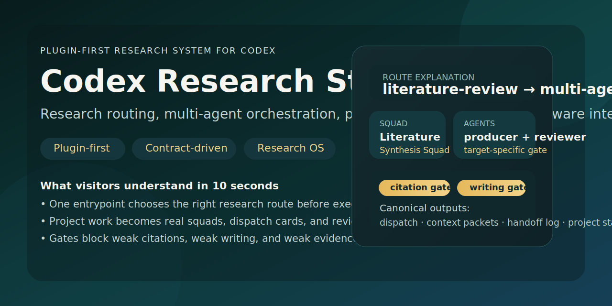
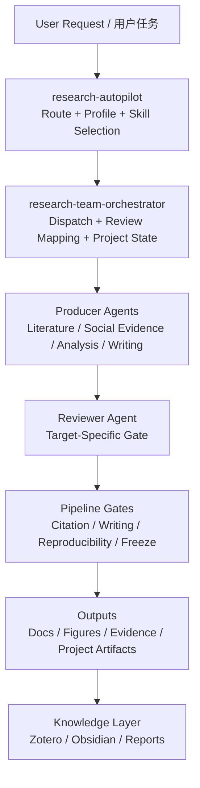

# Codex Research Stack

**A plugin-first research workflow stack for Codex: routing, multi-agent orchestration, research pipeline gates, and evidence-aware integrations.**

**一个以插件为中心的 Codex 研究工作栈：自动选路、多智能体编排、研究阶段门控，以及面向证据的集成链路。**




## What It Is | 这是什么

Codex Research Stack is a public, reusable layer built on top of Codex for research-heavy work.  
It focuses on four problems that most general coding agents do not solve well by default:

- routing a research task before execution
- turning project work into real multi-agent runs instead of role-play
- blocking invalid stage transitions with quality gates
- connecting writing, citation verification, social-platform evidence, Zotero, and Obsidian

Codex Research Stack 是一套建立在 Codex 之上的公开研究工作层。  
它重点解决四类通用 coding agent 默认处理不好的问题：

- 在执行前先判断研究任务该走哪条路线
- 把项目型任务变成真实多 agent 编排，而不是聊天式角色扮演
- 用阶段 gate 阻断错误推进
- 把写作、引文核验、社媒证据、Zotero 和 Obsidian 接成一条研究链

## Why It Matters | 为什么值得看

- **Research routing**: one entrypoint decides route, profile, helper skills, and next action.
- **Multi-agent orchestration**: project tasks default to structured planning with dispatch, review mapping, and canonical outputs.
- **Pipeline gates**: research stages, writing quality, citation integrity, and reproducibility are all explicit.
- **Evidence-aware integrations**: browser-visible platform evidence, DOI verification, Zotero sync, and Obsidian handoff live in one stack.
- **Reusable project scaffolding**: every project can start with a consistent research map, findings memory, material passport, and gate logs.

- **研究自动选路**：先选 route、profile、helper 和下一步，而不是直接胡乱调用 skill。
- **真实多 agent 编排**：项目型任务默认进入 dispatch、review mapping 和 canonical output 体系。
- **阶段门控**：研究阶段、写作质量、引文完整性和复现要求全部显式化。
- **证据链集成**：浏览器可见平台证据、DOI 核验、Zotero 同步和 Obsidian 沉淀在同一栈里。
- **可复用项目脚手架**：每个项目都可以从 research map、findings memory、material passport 和 gate log 起步。

## Who It Is For | 适合谁

- computational social science researchers
- social scientists working with literature, digital trace data, and writing-heavy projects
- Codex users who want a research-first orchestration layer instead of a generic coding workflow
- people building evidence-bound agent workflows on top of Codex

## Architecture At A Glance | 一眼看懂架构



For a fuller system map, see [Architecture](./docs/architecture.md).  
完整体系说明见 [Architecture](./docs/architecture.md)。

## Quick Start | 快速开始

### 1. Clone the public repo

```powershell
git clone https://github.com/avefield509-lang/codex-research-stack.git
cd codex-research-stack
```

### 2. Inspect the public contract assets

- `skills/catalog/`
- `skills/schemas/`
- `skills/plugins/research-autopilot/`
- `scripts/`

### 3. Initialize a minimal research project

```powershell
pwsh -ExecutionPolicy Bypass -File ".\scripts\init-research-project.ps1" -Path ".\examples\demo-project"
```

### 4. Validate the public stack

```powershell
python .\scripts\validate_research_stack.py
python .\scripts\validate_agents_contract.py
python .\scripts\validate_research_pipeline.py
```

## Typical Use Cases | 典型用例

- literature review with explicit citation verification
- computational social science projects with project-level agent dispatch
- social-platform case reading with browser-visible evidence rules
- writing workflows that require reference capture before export
- reproducible submission packages with stage gating

See [Use Cases](./docs/use-cases.md) for concrete scenarios.  
具体场景见 [Use Cases](./docs/use-cases.md)。

## Public Repo Boundary | 公开仓库边界

This public repo is **not** a mirror of a private local machine.  
It intentionally excludes:

- private credentials and SSH material
- cloud instance logs and operator notes
- personal application materials
- machine repair scripts and user-specific shell tuning
- local runtime blobs, caches, outputs, and trust state

这个公开仓库**不是**本地私有环境的完整镜像。  
它明确排除了：

- 私钥、凭证和账号痕迹
- 云主机运维日志和直连材料
- 个人申请材料
- 本机修复和私有 shell 定制脚本
- 本地运行时、缓存、输出和 trust 状态

More detail: [Public Boundary](./docs/public-boundary.md)

## Docs, Pages, and Contribution | 文档、Pages 与贡献

- Documentation index: [docs/index.md](./docs/index.md)
- GitHub Pages entry: `https://avefield509-lang.github.io/codex-research-stack/`
- Contribution guide: [CONTRIBUTING.md](./CONTRIBUTING.md)
- Privacy boundary: [PRIVACY-BOUNDARIES.md](./PRIVACY-BOUNDARIES.md)

## Roadmap | 路线图

Current focus:

- strengthen public examples
- make plugin metadata fully publishable
- add more visitor-friendly visuals
- keep the contract stable while expanding integrations

See [Roadmap](./docs/roadmap.md).

## Star This Repo | 如果你觉得有用

If this project helps you think about research routing, multi-agent contracts, or evidence-aware workflows in Codex, give it a star.  
如果这套思路对你的研究自动化、Codex 编排或证据链工作流有帮助，欢迎点一个 star。
