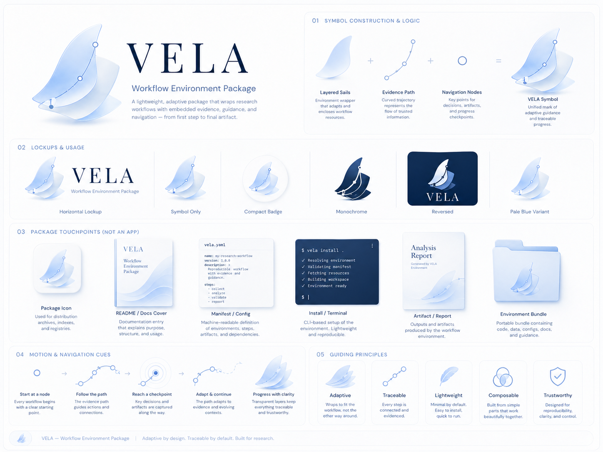
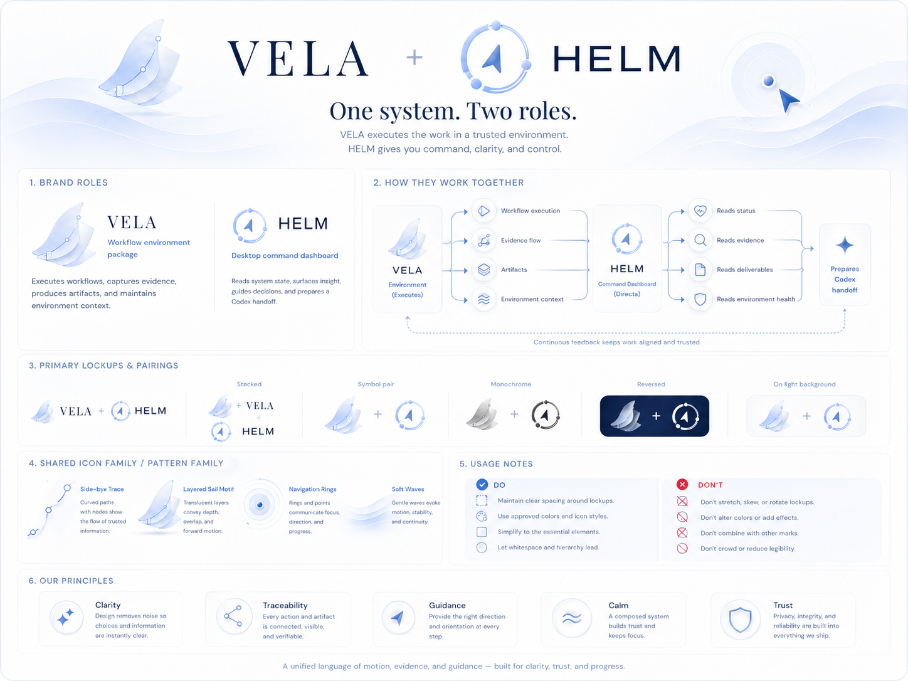

# VELA

[中文 README](./README.zh-CN.md) | [Pages](https://marcus-ai4ss.github.io/codex-research-stack/) | [中文 Pages](https://marcus-ai4ss.github.io/codex-research-stack/zh/)

**VELA = Versioned Evidence Lifecycle Architecture.**

Public subtitle: **Workflow Environment Package**. Chinese subtitle: **科研工作流环境**.

VELA is a portable research workflow environment for Codex. It packages the project structure, evidence rules, method checkpoints, handoff conventions, and visual language needed to run traceable research work from the first question to a deliverable artifact. It is not a desktop app, not a chat interface, and not a black-box paper generator.

## Product Boundary

VELA can be downloaded and used inside a user's own Codex environment without installing the local dashboard app. The workflow environment remains the primary artifact: docs, configs, prompts, evidence templates, project-state conventions, and reproducible handoff rules.

HELM is the companion brand for the optional local research board. HELM can read project state, surface evidence and deliverables, monitor environment health, and prepare Codex handoffs. VELA and HELM are independent products with one visual language: **use either separately; use both when you want a smoother local workflow.**

## What VELA Provides

- **Versioned evidence lifecycle.** Materials, evidence, claims, method artifacts, and deliverables stay distinct until the required fields and review steps are present.
- **Composable workflow stages.** Collect, analyze, validate, and report are treated as explicit phases with repairable gaps rather than hidden automation.
- **Codex handoff structure.** Context passed to Codex is scoped, inspectable, and tied to project state instead of loose chat history.
- **Portable environment package.** The package is designed to move between local Codex setups without depending on HELM.
- **Shared visual system.** Pale blue and white, layered sail forms, evidence traces, navigation rings, and calm iOS-style surfaces make the workflow recognizable without making it feel like a chat product.

## Relationship To HELM

| Brand | Public role | Depends on the other? |
| --- | --- | --- |
| **VELA** | Workflow environment package for Codex-based research work | No |
| **HELM** | Local research board for project state, evidence, deliverables, environment health, and Codex handoffs | No |

HELM is not the controller of VELA. VELA is not a plugin that only works inside HELM. Their integration point is project state and handoff context.

## Visual Language

The visual system is intentionally quiet: pale blue, white, navy text, translucent layers, trace paths, and navigation nodes. Core assets are under [`docs/assets/brand`](./docs/assets/brand/).

## Documentation

- [Pages home](https://marcus-ai4ss.github.io/codex-research-stack/)
- [Getting started](./docs/getting-started.md)
- [Installation notes](./docs/installation.md)
- [Workflow core](./docs/workflow-core.md)
- [Integrations](./docs/integrations.md)
- [Roadmap](./docs/roadmap.md)

## Public Naming Note

From this brand pass forward, public README and Pages copy use **VELA** for the workflow environment and **HELM** for the optional local board. Older internal module names may remain in historical docs or implementation files until they are safely migrated.
