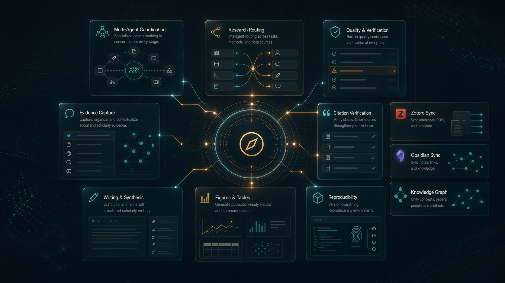
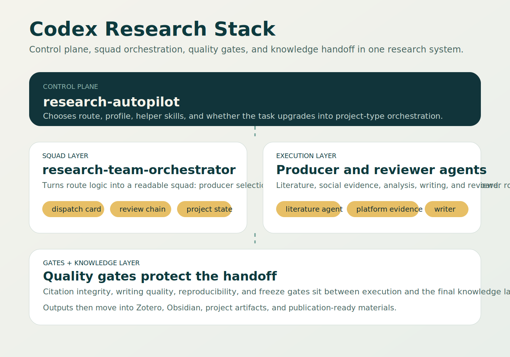

# Codex Research Stack

**A plugin-first research operating layer for Codex: routing, real multi-agent orchestration, pipeline gates, and evidence-aware integrations.**

**一个以插件为中心的 Codex 研究操作层：自动选路、真实多智能体编排、研究阶段门控，以及面向证据的集成链路。**


**Quick links**
- [GitHub Pages](https://avefield509-lang.github.io/codex-research-stack/)
- [Getting Started](./docs/getting-started.md)
- [Operator Guide](./docs/operator-guide.md)
- [New Project Guide](./docs/new-project-guide.md)
- [Architecture](./docs/architecture.md)
- [Use Cases](./docs/use-cases.md)
- [Minimal Project Example](./examples/minimal-project/README.md)



## Why This Repo Exists | 为什么会有这个仓库

Most coding-agent stacks are good at execution after a task is already defined.  
Research work fails earlier:

- the wrong route is chosen before execution starts
- project work is treated like a single chat instead of a real team workflow
- writing, citations, and evidence move without explicit quality gates
- Zotero, Obsidian, and browser-visible evidence stay disconnected

Codex Research Stack addresses exactly that layer. It does **not** try to replace Codex.  
It turns Codex into a more legible research system.

多数 coding agent 擅长“任务已经定义好之后”的执行。  
但研究任务更容易在前面几步出问题：

- 执行前就走错了 route
- 项目型任务被当成单线程对话，而不是团队工作流
- 写作、引文和证据链在没有 gate 的情况下被直接推进
- Zotero、Obsidian 与浏览器可见证据互相断开

Codex Research Stack 解决的正是这一层。它**不是**替代 Codex，而是把 Codex 变成一个更像研究系统的工作栈。

## What You Actually Get | 你实际拿到什么

| Layer | What it does | Why it matters |
| --- | --- | --- |
| `research-autopilot` | Chooses route, profile, helper skills, and next action before execution | Prevents the “wrong workflow, right effort” problem |
| `research-team-orchestrator` | Turns project work into squads, dispatch cards, review mappings, and project-state boards | Makes multi-agent work real instead of role-play |
| Contract + Gate layer | Uses explicit schemas, canonical paths, review rules, and pipeline gates | Blocks silent drift and unverifiable handoffs |
| Evidence + Knowledge integrations | Connects citations, Zotero, Obsidian, social evidence, and reproducibility artifacts | Keeps research outputs grounded and reusable |

## Product Tour | 产品预览

### 1. System overview comes first

The stack should look like a coherent research system before you read any schema or validator.


### 2. Project work becomes a real workspace

Project tasks are upgraded into readable squads with producers, reviewer mappings, handoffs, and project state.


### 3. Pipeline and gates stay visible

Writing, evidence, validity, and packaging are kept visible as explicit stages instead of being buried in chat history.


### 4. The repo still has a legible contract map

The public repo is intentionally organized as a small research OS layer:



## What Makes It Different | 它和一般 agent 仓库有什么不同

- **Plugin-first**: the public face of the stack is a plugin, not a loose set of prompts.
- **Contract-driven multi-agent**: squads, dispatch cards, reviewer mappings, and canonical paths are explicit.
- **Pipeline-aware**: a project can be blocked by citation, writing, evidence, or reproducibility gates.
- **Research-specific integrations**: Zotero, Obsidian, browser-visible social evidence, and writing-reference capture are first-class.
- **Reusable project scaffolding**: a new project starts with `AGENTS.md`, `research-map.md`, `findings-memory.md`, `material-passport.yaml`, and logs.

## DeepScientist-Style Direction, Codex-Native Execution | 借鉴 DeepScientist，但不替代 Codex

This repository is structurally closer to a research operating system than to a generic plugin demo.

What it borrows in spirit:

- project-first thinking instead of isolated task runs
- visible project memory and stage progression
- research artifacts that remain inspectable after the run

What it keeps different:

- Codex stays the runtime entrypoint
- the public layer is plugin-first
- contract assets and validators are emphasized over hidden heuristics

## Typical Use Cases | 典型用例

- literature reviews with DOI verification before formal use
- computational social science projects that need squad-level orchestration
- social-platform case studies that must stay inside browser-visible evidence boundaries
- writing flows where used references are captured before export
- submission packages with reproducibility and writing-quality checks

See [Use Cases](./docs/use-cases.md) for full walkthroughs.

## Quick Start | 快速开始

### 1. Clone the public repo

```powershell
git clone https://github.com/avefield509-lang/codex-research-stack.git
cd codex-research-stack
```

### 2. Inspect the contract assets

- `skills/catalog/`
- `skills/schemas/`
- `skills/plugins/research-autopilot/`
- `scripts/`

### 3. Create a project scaffold

```powershell
pwsh -ExecutionPolicy Bypass -File ".\scripts\init-research-project.ps1" -Path ".\examples\demo-project"
```

### 4. Validate the stack

```powershell
python .\scripts\validate_subagent_registry.py
python .\scripts\validate_agents_contract.py
python .\scripts\validate_research_pipeline.py
python .\scripts\validate_research_stack.py
```

## Docs and Pages | 文档与 Pages

- Pages: [https://avefield509-lang.github.io/codex-research-stack/](https://avefield509-lang.github.io/codex-research-stack/)
- Docs index: [docs/index.md](./docs/index.md)
- Architecture: [docs/architecture.md](./docs/architecture.md)
- Integrations: [docs/integrations.md](./docs/integrations.md)
- Roadmap: [docs/roadmap.md](./docs/roadmap.md)
- Contribution guide: [CONTRIBUTING.md](./CONTRIBUTING.md)

## Star This Repo | 如果你觉得有用

If this project helps you think more clearly about research routing, multi-agent contracts, or evidence-aware workflows in Codex, give it a star.

如果这套思路对你的研究自动化、Codex 编排或证据链工作流有帮助，欢迎点一个 star。
