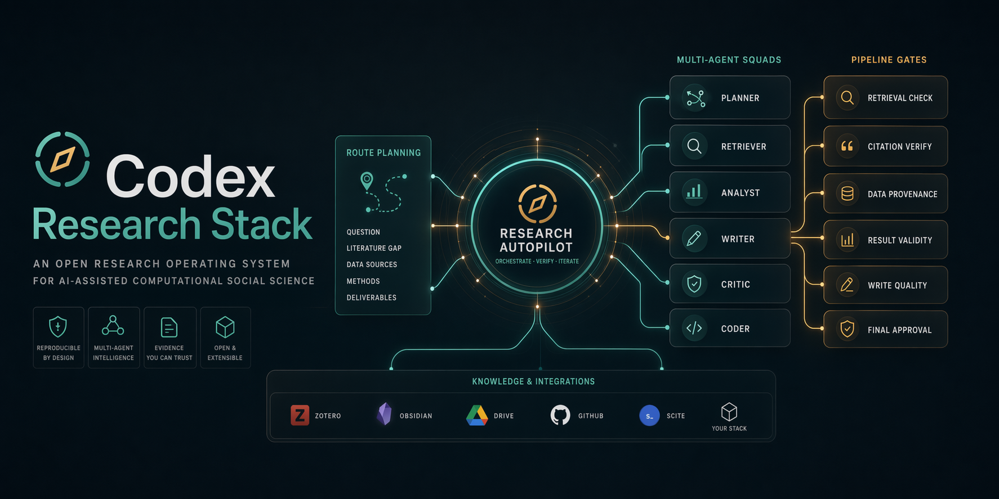
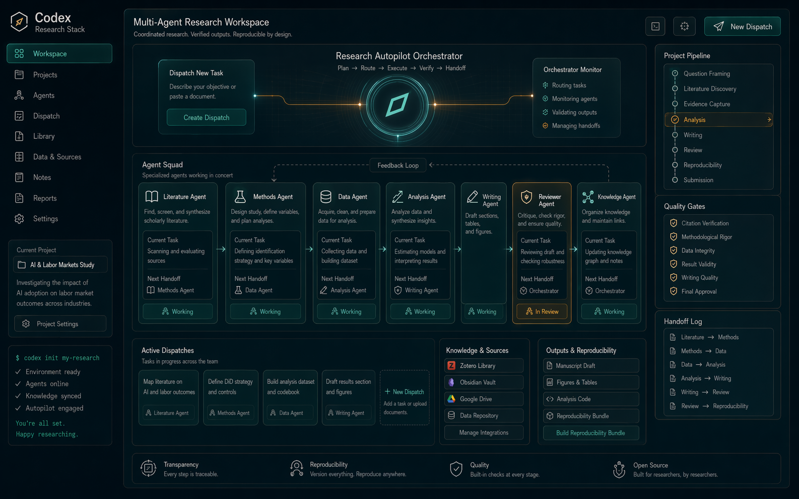
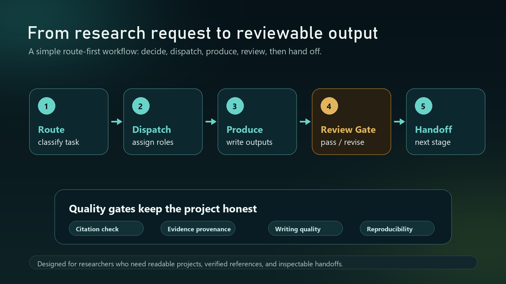
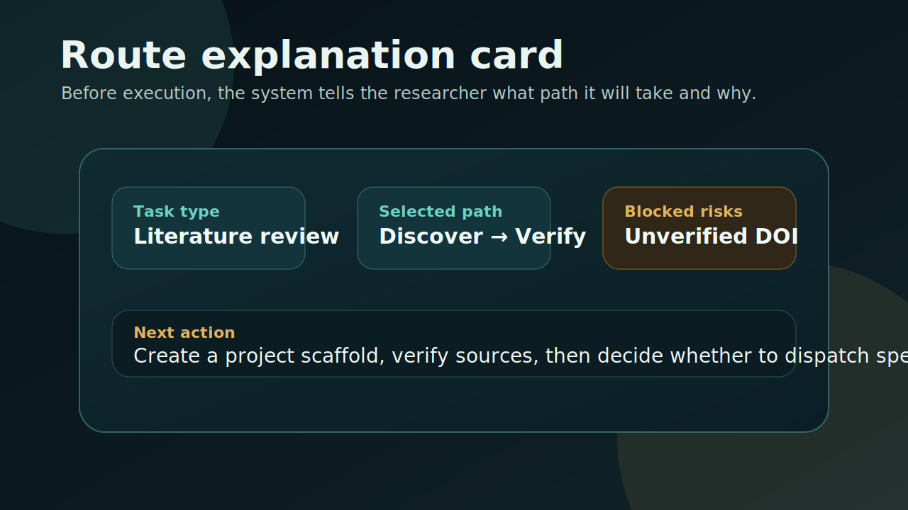
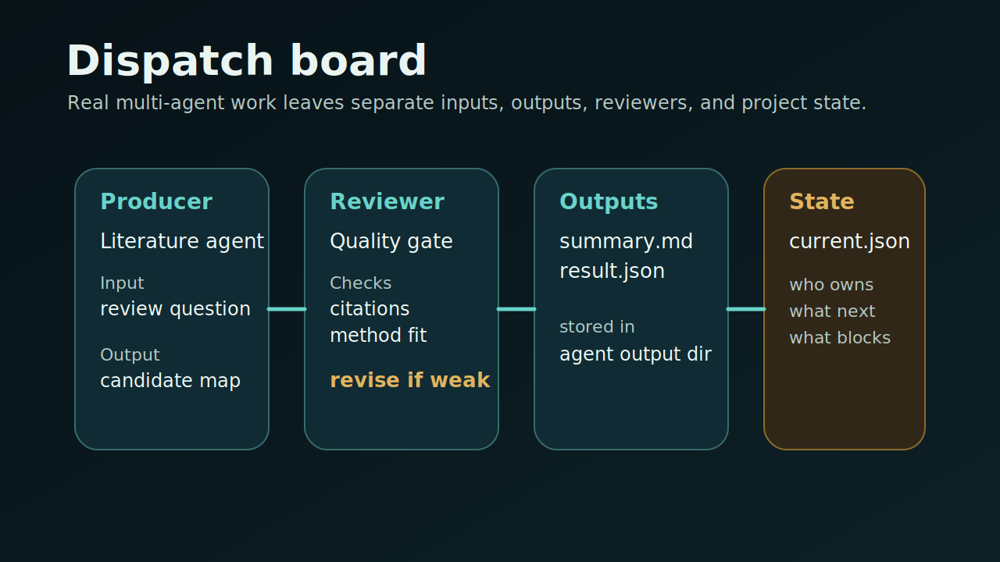
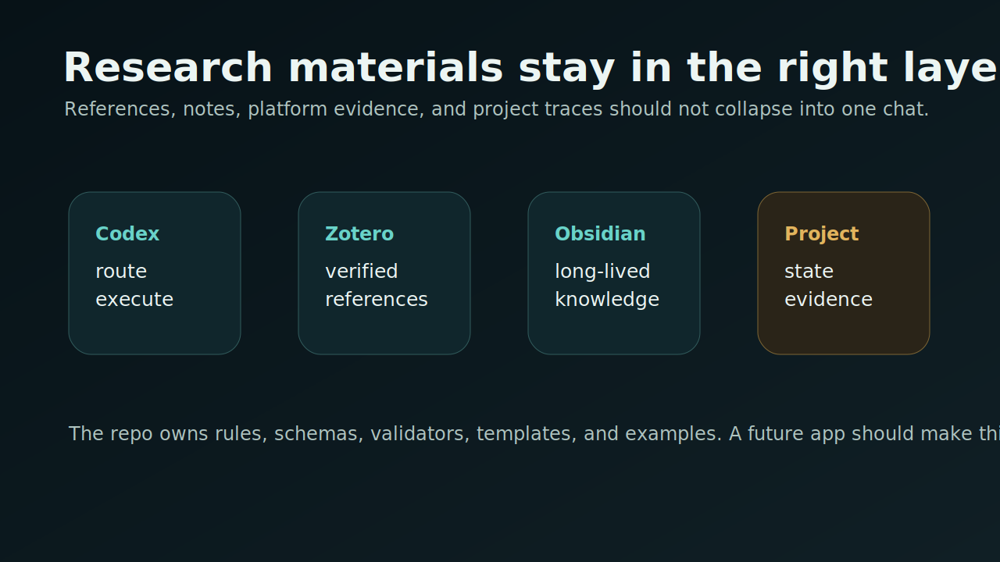

# Codex Research Stack

[中文 README](./README.zh-CN.md) | [Pages](https://avefield509-lang.github.io/codex-research-stack/) | [中文 Pages](https://avefield509-lang.github.io/codex-research-stack/zh/)

**A research workbench for Codex.**

Codex Research Stack is for researchers who want their work to stay readable as it grows.
Instead of turning everything into one long conversation, it helps you start with a clearer route,
keep project state visible, and keep references, writing, and reproducibility checks in view.



## Who it is for

- researchers doing literature reviews and evidence synthesis
- computational social scientists working across text, platform data, networks, and reproducibility
- policy and communication researchers who need browser-visible source capture
- writers preparing drafts, revision packs, and submission-ready materials

## What this repo helps you do

- decide what kind of research task you are doing before tools start running
- turn project work into a visible workspace instead of one long conversation
- keep references, writing quality, and reproducibility checks in view
- hand verified material into Zotero, Obsidian, and reusable project files

## What you get

- `research-autopilot`: explains the task path before work expands
- `research-team-orchestrator`: turns project work into visible roles, review steps, and handoffs
- project checks: blocks weak references, weak writing, and incomplete reproducibility
- project scaffolds: gives you a reusable structure instead of starting every project from scratch

## Start here first

If you only want one document, read the manual:

- [Research Stack Manual](./docs/manual.md)

If you want to jump to one chapter:

- [Quick start](./docs/manual.md#getting-started)
- [3-minute quick demo](./examples/quick-demo/)
- [How a new project begins](./docs/manual.md#starting-a-project)
- [What happens during a live project](./docs/manual.md#during-a-live-project)
- [Integrations](./docs/manual.md#integrations)
- [Repository and future app](./docs/manual.md#repository-and-future-app)

## Typical workflows

- **Literature review**: define a review question, collect candidate sources, verify formal references, and turn the project into a reviewable synthesis.
- **Social-platform case study**: capture browser-visible evidence, keep provenance explicit, and prepare material for later coding and analysis.
- **Computational social science project**: coordinate literature, sources, analysis, writing, and reproducibility as one project system.
- **Writing and submission**: move from evidence and analysis into drafts, writing checks, revision packs, and final submission materials.

## What it looks like

### Project workspace



### Checks and stage transitions



## Quick start

### 1. Clone the repository

```powershell
git clone https://github.com/avefield509-lang/codex-research-stack.git
cd codex-research-stack
```

### 2. Create a project scaffold

Cross-platform:

```powershell
python .\scripts\init_research_project.py --path ".\examples\demo-project" --route-hint "general-research"
```

Windows PowerShell shortcut:

```powershell
pwsh -ExecutionPolicy Bypass -File ".\scripts\init-research-project.ps1" -Path ".\examples\demo-project"
```

### 3. Read the quick demo

If you want to understand the workflow before running anything, read:

- [3-minute quick demo](./examples/quick-demo/)

## 3-minute demo

If you want to understand the repo without running anything first, read the demo in order:

1. [User prompt](./examples/quick-demo/demo-prompt.md)
2. [Route explanation card](./examples/quick-demo/route-explanation-card.md)
3. [Dispatch artifact](./examples/quick-demo/.codex/dispatch/demo-run.yaml)
4. [Project state](./examples/quick-demo/logs/project-state/current.json)
5. [Reviewer gate](./examples/quick-demo/outputs/agent-runs/demo-run/reviewer/gate.literature-producer.json)

## Learn the repo through one manual

- [Research Stack Manual](./docs/manual.md)

## Visual walkthrough

### Route explanation



### Multi-agent dispatch



### Research integrations



## Why this repo exists

Many agent systems become useful only after a task is already well defined.
Research work usually breaks earlier:

- the wrong kind of task is chosen first
- project work collapses into a single conversation
- references and writing move forward without visible checks
- project files, knowledge tools, and outputs drift apart

Codex Research Stack focuses on that layer. It does not replace Codex. It gives research work a clearer structure before the project becomes hard to inspect.

## Pages

- [English Pages](https://avefield509-lang.github.io/codex-research-stack/)
- [中文 Pages](https://avefield509-lang.github.io/codex-research-stack/zh/)

## Release

- Current public release notes: [v0.1.0](./.github/releases/v0.1.0.md)

## If this is useful

If this project helps you turn Codex into a clearer research workspace, give it a star.
