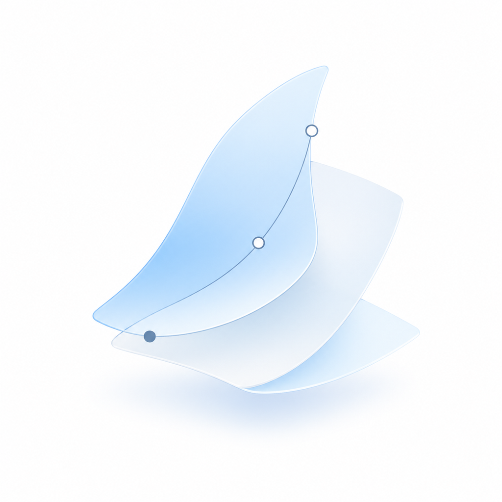

<div align="center">
  
  <h1>VELA</h1>
  <p><strong>Portable workflow wrapper package for Codex-based research</strong></p>
  <p><em>Versioned Evidence Lifecycle Architecture</em></p>
  <p>
    <a href="./README.zh-CN.md">中文</a>
    · <a href="https://marcus-ai4ss.github.io/VELA-Versioned-Evidence-Lifecycle-Architecture/">Pages</a>
    · <a href="./docs/getting-started.md">Getting started</a>
    · <a href="./docs/imports/vela-helm-interface.md">HELM interface</a>
    · <a href="./docs/workflow-core.md">Workflow core</a>
    · <a href="./docs/evidence-lifecycle.md">Evidence lifecycle</a>
    · <a href="./docs/quality-checks.md">Quality checks</a>
  </p>
</div>

VELA gives Codex a bounded, evidence-aware operating layer for research work. It packages project scaffolds, `AGENTS.md` instructions, Codex handoff contracts, evidence ledgers, claim checks, validation reports, and HELM-readable local state.

VELA is not a desktop app, chat interface, paper generator, citation manager, hidden autonomous agent, or private memory store. VELA prepares bounded work for Codex; Codex performs the task; people review the result. [HELM](https://github.com/Marcus-AI4SS/HELM) is the optional local research board that can read the same project state.

## Start In Five Minutes

```powershell
git clone https://github.com/Marcus-AI4SS/VELA-Versioned-Evidence-Lifecycle-Architecture.git vela
cd vela
.\install.ps1
.\vela.ps1 init ..\my-research-project --skip-codex-trust
cd ..\my-research-project
python ..\vela\scripts\vela.py handoff new --template claim-check
python ..\vela\scripts\vela.py handoff lint handoffs\H001.yaml
python ..\vela\scripts\vela.py handoff render handoffs\H001.yaml --out handoffs\H001.prompt.md
python ..\vela\scripts\vela.py validate . --repair-context
```

The generated project contains `materials/`, `evidence/`, `claims/`, `methods/`, `deliverables/`, `handoffs/`, `logs/`, `.codex/`, and `.vela/context.json`.

## What VELA Helps You Do

| Need | What VELA Gives You |
| --- | --- |
| Start a project without losing structure | A clear place for question, scope, sources, and expected deliverables |
| Keep evidence honest | A lifecycle that separates collected material from verified evidence |
| Work with Codex safely | Handoff packets that name the task, files, constraints, expected output, and review standard |
| Connect to HELM | `.vela/context.json` using `vela.project.context.v1` |
| Prepare shareable outputs | Checks that reveal unsupported claims and private material before a deliverable leaves the project |

## The Workflow

| Layer | Keep Here | Do Not Confuse It With |
| --- | --- | --- |
| Materials | DOI records, URLs, files, datasets, notes, captures | Evidence |
| Evidence | Verified materials with source, access time, status, and ethics or rights notes | A broad reading list |
| Claims | Candidate and supported statements | Final findings |
| Methods | Assumptions, coding rules, analysis plans, reproducibility notes | Results |
| Deliverables | Reports, briefs, figures, tables, status notes | Raw project state |
| Handoffs | Bounded tasks for Codex or collaborators | Whole-project delegation |

## A Good Codex Handoff

```yaml
schema_version: vela.codex.handoff.v1
handoff_id: H001
scope:
  task: Check whether a claim is supported by named evidence.
  relevant_files:
    - claims/C001.md
    - evidence/E001.yaml
constraints:
  - Do not add new claims.
expected_output:
  path: logs/codex-runs/H001-result.md
review_standard:
  - Every support judgment must cite an evidence_id.
```

The handoff is intentionally small. Codex should receive enough context to do the task, not an unbounded invitation to rewrite the project.

## VELA And HELM

| Product | Role | Can Stand Alone? |
| --- | --- | --- |
| **VELA** | Portable Codex workflow wrapper package | Yes |
| **HELM** | Local research board for status, evidence, deliverables, environment health, and Codex handoffs | Yes |

Use VELA by itself when you want a portable workflow. Add HELM when you want a visual local board over the same project state.

The shared import contract has two directions:

- `vela.project.context.v1`: VELA exposes project state that HELM can read.
- `helm.codex.handoff.v1`: HELM prepares a bounded Codex handoff packet that VELA can store under `handoffs/`.

See [VELA and HELM import interface](./docs/imports/vela-helm-interface.md).

## Read Next

- [Getting started](./docs/getting-started.md)
- [Workflow core](./docs/workflow-core.md)
- [Evidence lifecycle](./docs/evidence-lifecycle.md)
- [Quality checks](./docs/quality-checks.md)
- [VELA and HELM import interface](./docs/imports/vela-helm-interface.md)
- [Use cases](./docs/use-cases.md)
- [Integrations](./docs/integrations.md)
- [FAQ](./docs/faq.md)

## Repository Layout

| Path | Purpose |
| --- | --- |
| `docs/` | Public documentation, GitHub Pages, and approved visual assets |
| `docs/imports/` | VELA and HELM import contracts |
| `docs/sync-log/` | Local cross-repository synchronization notes |
| `examples/` | Minimal project and quick demo for inspection |
| `package/` | Starter package copied into a research project by `vela init` |
| `schemas/` | Machine-readable context and handoff schemas |
| `scripts/` | Setup, validation, and local maintenance helpers |
| `skills/` | Codex skill, profile, schema, and template layer |
