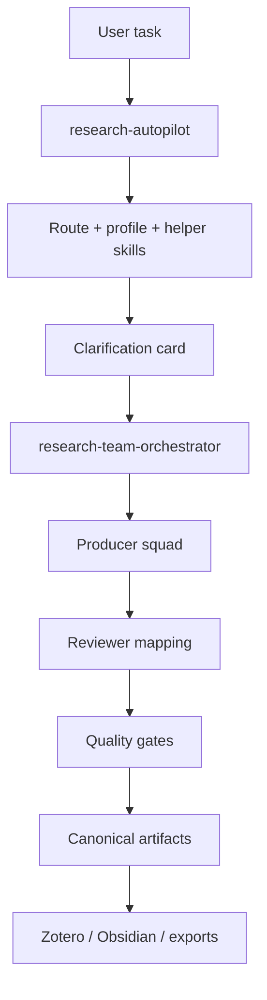

# Architecture

## The Big Idea

Codex Research Stack treats research work as a routed system, not a generic chat.

The system is organized into four visible layers:

1. **Control plane**
   `research-autopilot` decides the route, profile, helper skills, and whether the task upgrades into project-type orchestration.
2. **Squad layer**
   `research-team-orchestrator` turns a routed project into producers, reviewers, dispatch cards, and project-state artifacts.
3. **Gate layer**
   quality gates block invalid stage transitions, weak citations, weak writing, and unreproducible exports.
4. **Knowledge layer**
   verified outputs move into Zotero, Obsidian, and reusable project artifacts.

## Core Flow

## Why The Multi-Agent Layer Matters

The multi-agent layer is designed to prevent “fake multi-agent” behavior.

In this stack, a project only counts as a real multi-agent run if it has:

- explicit producer and reviewer roles
- dispatch artifacts
- context packets
- canonical output directories
- target-specific review mapping
- project state and gate logs

That is why the public repo emphasizes contracts and validators, not just prompt personas.

## Research Team Playbooks

The public stack now includes route-aligned team playbooks in:

- `skills/catalog/research_team_playbooks.json`

These playbooks make the system easier to inspect because each route can show:

- squad name
- mission
- default agents
- optional agents
- expected outputs
- review chain

Example direction:

- `literature-review` → Literature Synthesis Squad
- `social-platform-case` → Platform Evidence Squad
- `computational-social-science` → CSS Project Squad
- `social-science-submission-package` → Submission Package Squad

## Canonical Artifacts

The system keeps project traces visible through canonical paths.

- `.codex/dispatch/`
- `.codex/context-packets/`
- `outputs/agent-runs/`
- `logs/agent-handoffs/`
- `logs/quality-gates/`
- `logs/project-state/`

The goal is simple: when a run fails, a human should still be able to inspect what happened.

## Contract Assets

The main contract layer lives in:

- `skills/catalog/project_scope_rules.json`
- `skills/catalog/agent_execution_modes.json`
- `skills/catalog/subagent_registry.json`
- `skills/catalog/research_team_playbooks.json`
- `skills/catalog/quality_gates.json`
- `skills/catalog/research_pipeline_stages.json`
- `skills/catalog/writing_quality_rules.json`
- `skills/schemas/agent_dispatch_card.schema.json`
- `skills/schemas/project_agent_definition.schema.json`

## Knowledge Handoff

This public stack keeps a strict distinction between:

- **formal reference boundary** → Zotero
- **knowledge synthesis boundary** → Obsidian
- **project runtime boundary** → canonical project files

This separation is one of the reasons the stack behaves more like a research operating layer than a generic plugin bundle.
