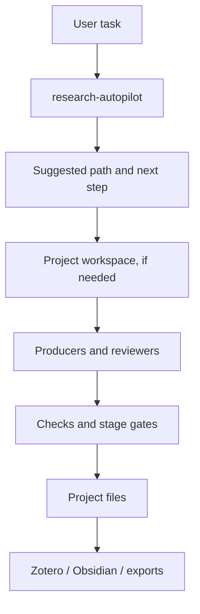

# Architecture

## In one sentence

Codex Research Stack helps a research task move through four practical stages:

1. understand the task,
2. organize the work,
3. block weak outputs,
4. hand verified material to the right place.

## What happens when a task comes in

### 1. The system decides how to begin

`research-autopilot` looks at the task first.
Its job is simple: explain what kind of work this is, choose an appropriate path,
and say what should happen next.

### 2. Project work becomes a workspace

If the task is large enough to count as a project, `research-team-orchestrator`
turns it into something more structured than a chat:

- who is producing the work
- who is reviewing it
- where the outputs go
- what still blocks progress

### 3. Weak work can be stopped

The stack uses explicit checks so that weak work does not quietly move forward.
These checks cover:

- citation integrity
- writing quality
- stage transitions
- reproducibility

### 4. Verified material is handed off cleanly

Once the work is good enough, it moves to the right boundary:

- formal references -> Zotero
- knowledge notes and synthesis -> Obsidian
- runtime traces -> project files

## When it is really multi-agent

This repo does not treat role-play as multi-agent work.
A run only counts as real multi-agent work when it has:

- separate producer and reviewer roles
- dispatch files
- context packets
- separate output folders
- review logs and gate results

That distinction matters because it keeps the project inspectable later.

## The files that matter most

These locations are the backbone of a project run:

- `.codex/dispatch/`
- `.codex/context-packets/`
- `outputs/agent-runs/`
- `logs/agent-handoffs/`
- `logs/quality-gates/`
- `logs/project-state/`

The point is not complexity for its own sake.
The point is that when something goes wrong, a human can still reconstruct what happened.

## Why the checks exist

Research projects often fail quietly:

- the wrong task type is chosen at the beginning
- references are treated as formal before they are verified
- writing becomes polished before the argument is sound
- outputs are exported before the project is reproducible

The check layer exists to slow those failures down and make them visible.

## How the main pieces fit together

## What this architecture is not trying to do

- It does not replace Codex.
- It does not hide everything behind one smart-looking answer.
- It does not merge formal references, knowledge notes, and runtime traces into one bucket.

It tries to make research work easier to follow, inspect, and reuse.
