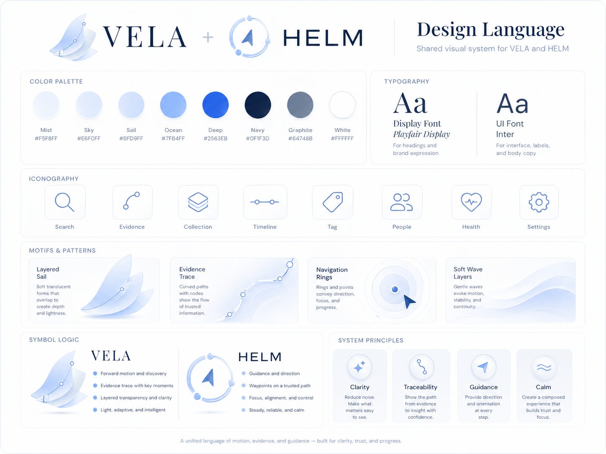

# VELA

**VELA** is the public workflow brand for the portable Codex research environment. It stands for **Versioned Evidence Lifecycle Architecture** and uses the subtitle **Workflow Environment Package**.

VELA is built for researchers who need a repeatable local workflow, not a single app surface. The package keeps research materials, evidence status, method checkpoints, deliverables, and Codex handoff context visible across the project.

## Core Promise

You can use VELA without HELM. Install or copy the workflow environment into your own Codex setup, keep project state in portable files, and hand scoped context to Codex when a task needs agentic work.

HELM is the optional local research board. It reads the same project state and makes evidence, deliverables, environment health, and handoffs easier to inspect. The public relationship is simple: **two independent products, one visual language.**

## Start Here

- [Getting started](./getting-started.md)
- [Installation notes](./installation.md)
- [Workflow core](./workflow-core.md)
- [Integrations](./integrations.md)
- [Use cases](./use-cases.md)
- [Roadmap](./roadmap.md)

## What It Is Not

VELA is not a chat app, not a desktop-only dashboard, and not a black-box research automation system. It is a workflow environment that makes the path from material to evidence to claim to artifact explicit.
