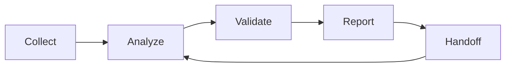

# Workflow Core

VELA organizes research work around a versioned evidence lifecycle. The workflow core is deliberately file- and state-oriented so it can run in a user's own Codex environment without requiring a dashboard app.

## Project Layers

- **Materials:** DOI records, URLs, files, datasets, platform captures, notes, and other source clues.
- **Evidence:** materials with source, access time, verification status, and rights or ethics notes.
- **Claims:** statements that require explicit support before they enter a deliverable.
- **Methods:** route notes, assumptions, data decisions, coding rules, analysis plans, and reproducibility checks.
- **Deliverables:** reports, papers, briefs, figures, tables, status exports, and handoff summaries.
- **Handoffs:** scoped context packages for Codex or another agent.

## Lifecycle

## Evidence Rule

Materials are not evidence by default. A material becomes usable evidence only when the project records the source, access time, verification status, and rights or ethics boundary. Claims remain unsupported until they are linked to evidence with a support explanation.

## HELM Link

HELM can project this workflow state into a local board. That projection is useful for scanning and handoff preparation, but it is not the source of VELA's independence. VELA remains the portable workflow environment.
