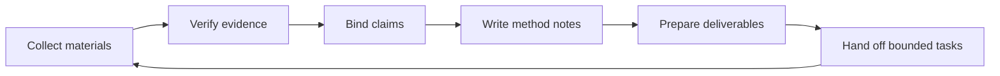

# Workflow Core

VELA keeps research work in layers. Each layer answers a different question.

| Layer | Question |
| --- | --- |
| Materials | What have I collected? |
| Evidence | What has been verified enough to support a claim? |
| Claims | What am I trying to say? |
| Methods | How did I produce or interpret the evidence? |
| Deliverables | What can be shared from the current project state? |
| Handoffs | What should Codex or a collaborator do next? |

## Lifecycle

## Operating Rule

Do not collapse layers too early. A note is not evidence, a candidate claim is not a finding, and a generated draft is not a project fact until the supporting state is visible.
